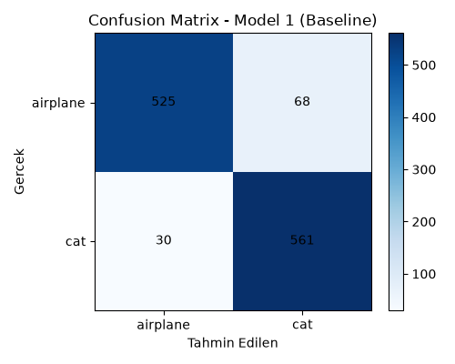
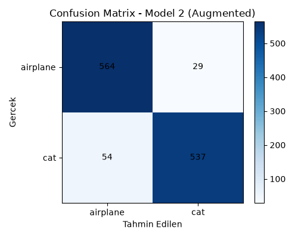
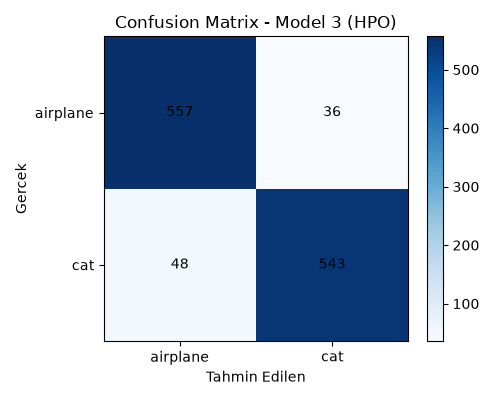
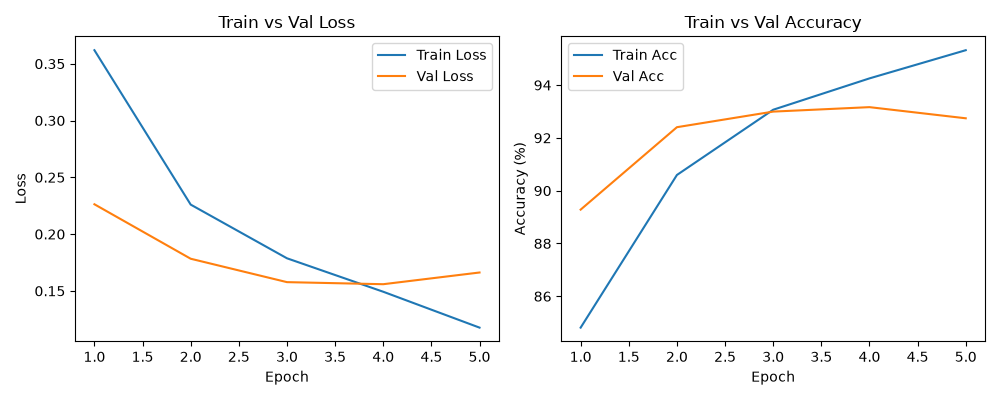
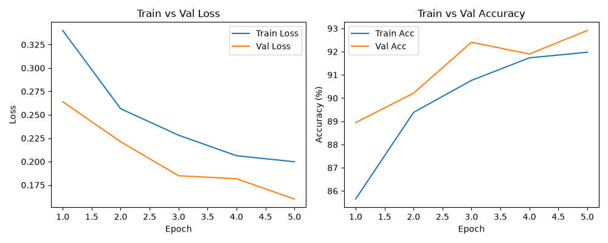
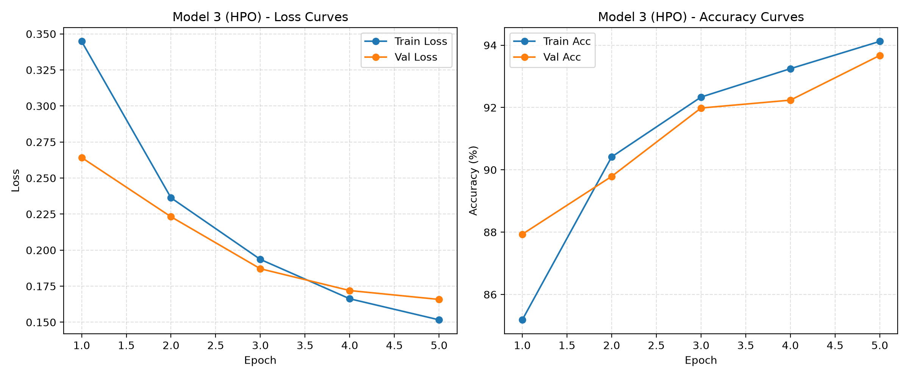

# CatVsJet — 3-Model Comparison

This report compares the performance of the CatVsJet CNN across 3 development stages. Every model uses the same base architecture (a simple 2-layer convolutional CNN) and the same fixed train/validation/test split (80/10/10, class-balanced). Each was trained for 5 epochs.

- **Model 1 (Baseline):** The base model with a proper train/validation/test split and performance metrics added.
- **Model 2 (Augmented):** Model 1 with data augmentation applied to the training data only (horizontal flip, brightness/contrast jitter, ±15° rotation).
- **Model 3 (HPO):** Model 1 with `learning_rate` and `batch_size` optimized via Optuna (no augmentation).

Model 2 and Model 3 were each built independently from Model 1 — meaning both were developed from the same source (the baseline), not from one another.

## Results Table (Test Set, 1,184 images)

> **Note:** Precision, Recall, and F1-Score below are computed for the **"cat" class specifically** (scikit-learn's default positive class in binary classification). Accuracy covers both classes together. See the per-class breakdown further below for the "airplane" class.

| Metric | Model 1 (Baseline) | Model 2 (Augmented) | Model 3 (HPO) |
|---|---|---|---|
| Accuracy | 91.72% | **92.99%** | 92.91% |
| Precision (cat) | 89.19% | **94.88%** | 93.78% |
| Recall (cat) | **94.92%** | 90.86% | 91.88% |
| F1-Score (cat) | 91.97% | **92.83%** | 92.82% |

### Per-Class Breakdown (airplane)

| Metric | Model 1 (Baseline) | Model 2 (Augmented) | Model 3 (HPO) |
|---|---|---|---|
| Precision (airplane) | 94.59% | 91.26% | 92.07% |
| Recall (airplane) | 88.53% | **95.11%** | 93.93% |
| F1-Score (airplane) | 91.46% | **93.15%** | 92.99% |

## Confusion Matrices

| Model 1 | Model 2 | Model 3 |
|---|---|---|
|  |  |  |

## Train vs. Validation Curves

| Model 1 | Model 2 | Model 3 |
|---|---|---|
|  |  |  |

## Analysis

**Model 1 (Baseline):** By epoch 5, train accuracy (95.32%) has pulled ahead of validation accuracy (92.74%) — a gap of about 2.6 points. This is a sign of mild overfitting starting to set in. Not a serious issue at this stage, but a trend that would likely grow with longer training. Looking at the per-class breakdown, the model is also noticeably weaker at catching airplanes (88.53% recall) than cats (94.92% recall) — it misclassifies airplanes as cats more often than the reverse.

**Model 2 (Augmented):** After adding augmentation, train and validation accuracy stayed much closer together, with validation accuracy even surpassing train accuracy at several points. This shows augmentation effectively reduced overfitting — since the training data looked slightly different (rotated, brightness-shifted) on every epoch, the model was pushed to learn more general patterns instead of memorizing. Precision rose noticeably (89.19% → 94.88%), while recall dropped (94.92% → 90.86%) — the model became more selective/cautious about predicting "cat."

**Model 3 (HPO):** Trained with the hyperparameters Optuna found (`learning_rate ≈ 0.000376`, `batch_size = 16`), this model performed nearly identically to Model 2 (accuracy differs by just 0.08 points, F1 by 0.01 points). It achieved a similar-sized gain through a different mechanism — improving the learning process itself rather than the training data.

**Overall takeaway:** Both data augmentation and hyperparameter optimization improved on the baseline by a similar margin, but through different paths — augmentation by reducing overfitting, HPO by improving the efficiency of learning. The fact that both land so close to each other suggests the current simple architecture (2 convolutional layers) may be approaching a performance ceiling for this dataset. A natural next step would be combining augmentation and HPO in a single model, or extending the architecture with additional layers.
